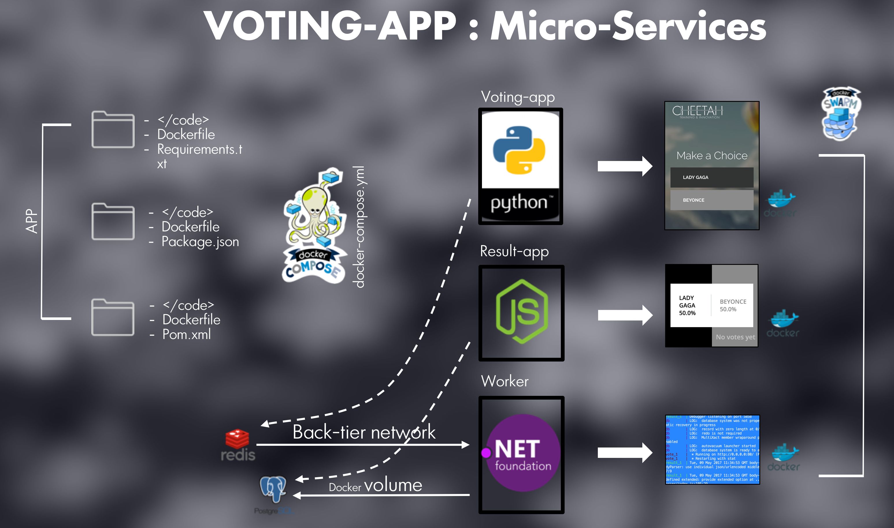

Getting started
---------------

CHEETAH Version (based on "Docker-voting-app") to demonstrate a micro-services App with Docker.

Download [Docker](https://www.docker.com/products/overview). If you are on Mac or Windows, [Docker Compose](https://docs.docker.com/compose) will be automatically installed. On Linux, make sure you have the latest version of [Compose](https://docs.docker.com/compose/install/).


Run in this directory:
```
docker-compose up
```
The app will be running at [http://localhost:5000](http://localhost:5000), and the results will be at [http://localhost:5001](http://localhost:5001).

Alternately, if you want to run it on a [Docker Swarm](https://docs.docker.com/engine/swarm/), first make sure you have a swarm. If you don't, run:
```
docker swarm init
```
Once you have your swarm, in this directory run:
```
docker stack deploy --compose-file docker-stack.yml vote
```

Architecture
-----



* A Python webapp which lets you vote between two options
* A Redis queue which collects new votes
* A .NET worker which consumes votes and stores them in…
* A Postgres database backed by a Docker volume
* A Node.js webapp which shows the results of the voting in real time

Customize it!
-----

* Edit vote/app.py
* Edit result/views/index.html

Note
----

The voting application only accepts one vote per client. It does not register votes if a vote has already been submitted from a client.
